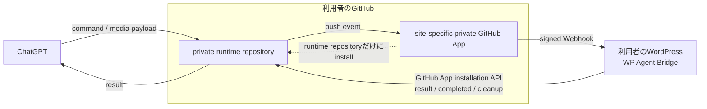

# WP Agent Bridge

ChatGPTからWordPressの記事・ページ・設定などを更新するためのWordPressプラグインです。

通常のWordPress操作は、**利用者自身が所有するprivate GitHub runtime repository**と、**そのWordPress専用のprivate GitHub App**を使って実行します。WP Agent Bridge運営者のruntime repository、relay server、GitHub Actions workerを通常経路として使用しません。

## 現在の配布状態

- Version: `1.1.5`
- Status: **release candidate / validation in progress**
- merged `main`にはv0.9.6互換レイヤーとして、Site Icon専用操作、media upload capability、ローカル/connector画像のbatched staged upload案内、複数theme fileのlist/search/read-manyを含みます。
- v0.9.6機能を含むmerged-mainの1.1.5 ZIP、外部テストキット、配布参照は別工程で更新します。
- 既存の`v1.1.4-rc1`は1.1.4時点のテスト成果物として保持し、上書きしません。
- broader public / stable releaseはまだ宣言していません。

## 構成



通常のデータ経路は次のとおりです。

`ChatGPT → 利用者のprivate runtime repository → site-specific GitHub App signed Webhook → 利用者のWordPress → 利用者のruntime repository → ChatGPT`

GitHub Appは利用者自身のGitHubアカウントに作成し、対象のprivate runtime repositoryだけへinstallします。WordPressは、そのAppのinstallation tokenを使って同じrepositoryへresult / completed / media cleanupを書き戻します。

### 運営者側を経由しないもの

| データ / 資格情報 | 保存・処理される場所 | WP Agent Bridge運営者側へ送信 |
| --- | --- | --- |
| command / result | 利用者のprivate runtime repository | しない |
| media一時payload | 利用者のprivate runtime repositoryまたは利用者のWordPress一時領域 | しない |
| 記事本文・WordPress設定 | 利用者のWordPress、および依頼内容に必要な範囲のruntime command/result | しない |
| GitHub App private key / Webhook secret | 利用者のWordPress内で暗号化保存 | しない |

## 設計上の前提

- ダウンロード・インストール・利用は無料。
- 通常運用で運営者所有のGitHub Organization、private repository、WordPress、relay serverの資源を使用しない。
- runtime command/result、記事本文、WordPress設定等を運営者側へ送信・保存しない。
- GitHub Appのprivate keyとWebhook secretは、接続先WordPress内へAES-256-GCMで暗号化して保存する。
- 通常のWordPress操作にGitHub Actions、旧Bridge Key、`takka-d/chatgpt-data`、WPVibeを使用しない。

## 導入

1. WP Agent BridgeのZIPをWordPressへアップロードし、有効化する。
2. **ツール > WP Agent Bridge** を開く。
3. 画面の案内から、利用者自身のGitHubアカウントに専用private runtime repositoryを作成する。
4. **Connect GitHub** を押す。GitHub App manifestにより、このWordPress専用のprivate GitHub Appを利用者自身のGitHub側に作成する。
5. GitHub Appのインストール時に **Only select repositories** を選び、手順3のruntime repositoryだけを選択する。
6. WP Agent Bridgeが`wp-agent-bridge-runtime` branch、runtime marker、command/result/media用ディレクトリを初期化する。
7. ChatGPTのGitHub接続から、その利用者自身のruntime repositoryを利用できることを確認する。
8. ChatGPTにWordPress操作を依頼する。

PAT、Webhook secret、private key、Bridge Key、GitHub Actions workflowを利用者が手入力することは想定していません。

## Runtime identity

ChatGPTはWordPress操作前に、runtime repositoryの`wordpress-bridge/RUNTIME_CONNECTION.json`を確認できます。正常な自己完結runtimeでは少なくとも次を示します。

```json
{
  "status": "canonical",
  "transport": "direct-github-webhook",
  "ownership": "user-owned",
  "operator_relay": false,
  "runtime_branch": "wp-agent-bridge-runtime"
}
```

repository名と`site_host`も、実際の接続先と一致している必要があります。

## 主な用途

- 投稿・固定ページの取得、作成、更新
- 本文の検索・部分編集・一括編集
- HTML tableの行・セル編集
- post meta、taxonomy、menu等の管理
- plugin / themeの管理
- theme fileの編集
- `theme.files.list` / `theme.files.search` / `theme.file.read.many`による複数theme fileの一括調査
- Draft Themeのpreview / publish / rollback
- media upload
- `site.icon.get` / `site.icon.set` / `site.icon.clear`によるSite Icon(favicon)管理
- `media.upload.capabilities`によるmedia経路確認
- WP-Cron管理
- WordPress REST APIを利用した各種操作

変更操作には、操作内容に応じてpreview、confirm、SHA-256、plan hash、impact hash、stale-write rejection、active theme/plugin protection等のguardを適用します。

Site Iconは汎用option patcherでscalar `site_icon`を書き換えるのではなく、専用guard付きsurfaceを使用します。既存画像ならattachment IDから設定でき、新規画像ならmedia uploadとSite Icon設定を1コマンドで実行できます。

任意のshell command、任意のWP-CLI文字列、無制限のSQL writeは公開しません。

## 画像・ファイル転送

WordPress側のmedia上限は6 MiBです。転送経路はsourceとconnector capabilityに応じて選びます。

### ChatGPTローカル／会話添付／sandbox／connectorから取得したファイル

GitHub connectorに任意のローカルfile parameterがなくても、それ自体はblockerではありません。GitHubがUTF-8 text/blobを書ける場合は、**batched staged-media pathを優先**します。

1. 元binary全体のbytes / SHA-256を計算する。
2. 元binaryを順序付きのbounded chunkへ分割してから、各chunkを独立してBase64化する。
3. Base64文字列を`wordpress-bridge/media/pending/*.b64`へUTF-8 textとしてstageする。
4. ordered `data_paths`、`filename`、`expected_bytes`、`expected_sha256`を持つ `/wp-agent-bridge-runtime/v1/media-upload` commandを**1件だけ**作る。
5. `create_blob` / `create_tree` / `create_commit` / `update_ref`が利用できる場合は、payload群とcommandを1つのtree/commit/ref更新で公開する。
6. `create_file`しか使えない場合も、payload群を先にstageし、最後にupload command 1件だけを作る。
7. WordPressが全chunkを再構成・検証してMedia Libraryへ登録し、成功後にstaged payloadをcleanupする。

Google Drive等のconnectorから取得した画像も、ChatGPT側で取得した後は同じlocal binaryとして扱います。WordPress側にGoogle Drive credentialは不要です。

同じ新規画像をSite Iconへ設定する場合は、media-upload commandに`set_site_icon=true`と`confirm_site_icon=true`を追加できます。必要なら`expected_site_icon_id`でstale-writeを拒否します。

### Sequential chunk-command fallback

`/wp-agent-bridge-media/v1/upload-chunk`は、GitHub connectorがbounded Base64 text/blobを可靠にstageできない場合、またはbatched staged-media書き込みが実際に失敗した場合だけ使用します。ローカルfile parameterがないという理由だけで、この遅い経路へ落としません。

fallbackでもwhole-file / per-chunk bytes・SHA-256、順序、decoded上限を検証します。

### 既存GitHub-staged / remote media

GitHub connectorが既にmanageableなmediaも、同じ`wordpress-bridge/media/pending/*.b64` + `/wp-agent-bridge-runtime/v1/media-upload`のbatched pathを使えます。元binaryを先に分割し、各chunkを独立Base64化し、可能ならpayload群+commandを1つのGit tree/commit/ref更新で公開し、WordPress側で再構成・integrity確認・bounded cleanupを行います。

## Site Icon / favicon

v0.9.6では専用のguarded surfaceを使います。

- `site.icon.get`: 現在のattachment ID、URL、MIME、dimensions等を取得
- `site.icon.set`: 既存Media Library画像をattachment IDで設定。`confirm=true`必須、`expected_current_id`によるstale-write protection対応
- `site.icon.clear`: attachment自体を削除せずSite Icon設定だけ解除。`confirm=true`必須、`expected_current_id`対応
- `media.upload.capabilities`: local / connector / Driveを含むmedia upload経路を確認

## 複数theme file調査

v0.9.6では、WPVibeや単一file readの反復を避けるため、server-side theme inspectionに次を追加しています。

- `theme.files.list`: optional glob付きのbounded file list
- `theme.files.search`: bounded substring searchとline/context取得
- `theme.file.read.many`: 最大20file rangeを1回のBridge commandで取得

いずれもtheme root境界内に制限され、任意filesystem readにはしません。

## 配送失敗からの復旧

GitHub pushはdurable queueではないため、WebhookやGitHub書き戻しを一度取りこぼす可能性があります。Direct Runtimeはvalidなpushごとに現在の`commands/pending/`も再走査します。

1.1.4以降では、authenticated runtime pushをprimary executorへ渡す前にWordPress側で直列化します。これにより、別pushのrecovery scanがまだ実行中の同一commandへ重なり、request-id idempotencyが返したtemporaryな`idempotency_in_progress`をGitHub result/completedへterminal resultとして確定する競合を防ぎます。

同一`request_id`はWordPress側でcompleted responseを再利用するため、`WordPress実行成功 → GitHub result書き戻し失敗`が起きても、後続pushで副作用を二重実行せずbookkeepingを復旧する設計です。

## セキュリティ

外部からWordPressへ入るDirect RuntimeのWebhookは、site-specific GitHub AppのWebhook secretによるSHA-256 HMAC署名を検証します。さらに、push元が設定済みのprivate repository、installation ID、repository ID、`wp-agent-bridge-runtime` branchと一致する場合だけ処理します。

WordPress内部ではBridge coreのguarded REST surfaceをローカル実行し、request ID、allowlist、preview / confirm、stale-write protection等を適用します。詳細は[`SECURITY.md`](SECURITY.md)を参照してください。

## 更新安全性

Bridge self-updateは完全manifestを要求します。manifestに含まれない既存ファイルを暗黙削除とは扱いません。削除する場合は`delete_paths`と明示確認が必要で、bootstrapのPHP依存関係とPHP構文も置換前に検証します。

## 必要環境

- WordPress 6.9以上
- PHP 7.4以上
- HTTPSで公開され、WordPress REST APIへGitHub Webhookから到達可能なサイト
- OpenSSL(AES-256-GCM / RSA signing)
- GitHubアカウント
- GitHubを接続できるChatGPT環境

## 配布

公開ZIPにはWP Agent Bridge本体だけを含めます。旧central/operator Onboarding Service、diagnostics、開発用command/result履歴、秘密情報、無関係なproject dataは含めません。自己完結GitHub onboardingはWP Agent Bridge本体に含まれます。

外部テスト手順は[`docs/EXTERNAL_TEST_GUIDE_JA.md`](docs/EXTERNAL_TEST_GUIDE_JA.md)、release gateは[`PUBLIC_RELEASE.md`](PUBLIC_RELEASE.md)を参照してください。

WordPress.org Plugin Directoryからの配布は予定していません。

## License

無料でダウンロード・インストール・利用できます。個人的・非公開の改変は可能です。

元のソフトウェア、改変版、fork、build等を第三者へ再配布、販売、ミラー配布、第三者向けダウンロードとして提供することは禁止します。詳細は[`LICENSE.md`](LICENSE.md)を参照してください。

このライセンスは独自のsource-available licenseであり、オープンソースライセンスではありません。

## Status

**1.1.5 release candidate / validation in progress.**

v0.9.6のfunctional sourceはPR #32で`main`へmerge済みです。Site Icon、connector/local media、複数theme file inspectionについてWPVibeへ迂回する必要を減らす機能はsource側へ入っており、実環境installer検証、Markdown同期、merged-main ZIP、tester kit、配布参照は分離して更新します。
