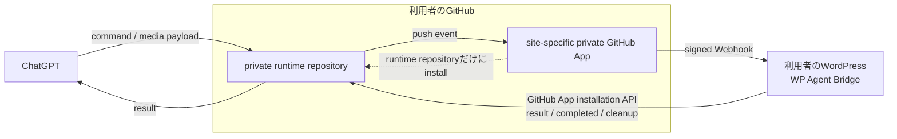
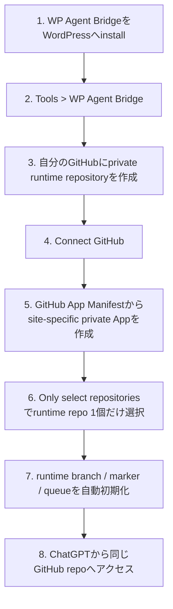

# WP Agent Bridge

ChatGPTからWordPressの記事・ページ・設定などを更新するためのWordPressプラグインです。

通常のWordPress操作は、**利用者自身が所有するprivate GitHub runtime repository**と、**そのWordPress専用のprivate GitHub App**を使って実行します。WP Agent Bridge運営者のruntime repository、relay server、GitHub Actions workerを通常経路として使用しません。

## 現在の配布状態

- Version: `1.1.4`
- Status: **release candidate / external tester distribution ready**
- External-test prerelease: [`v1.1.4-rc1`](https://github.com/takka-d/wp-agent-bridge/releases/tag/v1.1.4-rc1)
- テスト用plugin ZIP: [`wp-agent-bridge-1.1.4.zip`](https://github.com/takka-d/wp-agent-bridge/releases/download/v1.1.4-rc1/wp-agent-bridge-1.1.4.zip)
- 再現可能なplugin ZIP SHA-256: `f63179ebe454b4ee42bf6b5bb1e3e23f935ee976b81ec8bc69e750828b1871c0`
- broader public / stable releaseはまだ宣言していません。

## 構成



通常のデータ経路は次のとおりです。

`ChatGPT → 利用者のprivate runtime repository → site-specific GitHub App signed Webhook → 利用者のWordPress → 利用者のruntime repository → ChatGPT`

GitHub Appは利用者自身のGitHubアカウントに作成し、対象のprivate runtime repositoryだけへinstallします。WordPressは、そのAppのinstallation tokenを使って同じrepositoryへresult / completed / media cleanupを書き戻します。

### 運営者側を経由しないもの

| データ / 資格情報 | 保存・処理される場所 | WP Agent Bridge運営者側へ送信 |
| --- | --- | --- |
| command / result | 利用者のprivate runtime repository | しない |
| media一時payload | 利用者のprivate runtime repository | しない |
| 記事本文・WordPress設定 | 利用者のWordPress、および依頼内容に必要な範囲のruntime command/result | しない |
| GitHub App private key / Webhook secret | 利用者のWordPress内で暗号化保存 | しない |

## 設計上の前提

- ダウンロード・インストール・利用は無料。
- 通常運用で運営者所有のGitHub Organization、private repository、WordPress、relay serverの資源を使用しない。
- runtime command/result、記事本文、WordPress設定等を運営者側へ送信・保存しない。
- GitHub Appのprivate keyとWebhook secretは、接続先WordPress内へAES-256-GCMで暗号化して保存する。
- 通常のWordPress操作にGitHub Actions、旧Bridge Key、`takka-d/chatgpt-data`、WPVibeを使用しない。

## 導入



1. WP Agent BridgeのZIPをWordPressへアップロードし、有効化する。
2. **ツール > WP Agent Bridge** を開く。
3. 画面の案内から、利用者自身のGitHubアカウントに専用private runtime repositoryを作成する。
4. **Connect GitHub** を押す。GitHub App manifestにより、このWordPress専用のprivate GitHub Appを利用者自身のGitHub側に作成する。
5. GitHub Appのインストール時に **Only select repositories** を選び、手順3のruntime repositoryだけを選択する。
6. WP Agent Bridgeが`wp-agent-bridge-runtime` branch、runtime marker、command/result/media用ディレクトリを初期化する。
7. ChatGPTのGitHub接続から、その利用者自身のruntime repositoryを利用できることを確認する。
8. ChatGPTにWordPress操作を依頼する。

PAT、Webhook secret、private key、Bridge Key、GitHub Actions workflowを利用者が手入力することは想定していません。

## Runtime identity

ChatGPTはWordPress操作前に、runtime repositoryの`wordpress-bridge/RUNTIME_CONNECTION.json`を確認できます。正常な自己完結runtimeでは少なくとも次を示します。

```json
{
  "status": "canonical",
  "transport": "direct-github-webhook",
  "ownership": "user-owned",
  "operator_relay": false,
  "runtime_branch": "wp-agent-bridge-runtime"
}
```

repository名と`site_host`も、実際の接続先と一致している必要があります。

## 主な用途

- 投稿・固定ページの取得、作成、更新
- 本文の検索・部分編集・一括編集
- HTML tableの行・セル編集
- post meta、taxonomy、menu等の管理
- plugin / themeの管理
- theme fileの編集
- Draft Themeのpreview / publish / rollback
- media upload
- WP-Cron管理
- WordPress REST APIを利用した各種操作

変更操作には、操作内容に応じてpreview、confirm、SHA-256、plan hash、impact hash、stale-write rejection、active theme/plugin protection等のguardを適用します。

任意のshell command、任意のWP-CLI文字列、無制限のSQL writeは公開しません。

## 画像・ファイル転送

WordPress側のmedia上限は6 MiBです。runtime command JSON自体は2 MiB以下に制限します。

自己完結runtimeでは、大きな画像を1個のcommand JSONへBase64直埋めしません。Base64 payloadを利用者自身のruntime repositoryの`wordpress-bridge/media/pending/*.b64`へ置き、小さいcommandから`/wp-agent-bridge-runtime/v1/media-upload`を呼び出します。

1. ChatGPT側で元ファイルのbytes / SHA-256を計算する。
2. **元binaryを先に小分けし、各binary chunkを独立してBase64化する。** 1本の巨大Base64文字列を作ってから任意位置で切る方式は使わない。
3. 各`.b64` payloadは8,000 Base64文字以下を基準とする。
4. Git Data操作が利用できる場合は各payloadをblobとして先にstagingし、**blob SHAでread-backして文字数とSHA-256を照合した後**、payload群とupload commandを1つのtree / commit / ref更新でruntime branchへ公開する。
5. WordPress側がordered `data_paths`を1ファイルずつstrict Base64 decodeし、binary chunkを順序どおり連結する。
6. 再構成後に`expected_bytes` / `expected_sha256`を検証してMedia Libraryへ登録する。
7. 成功後は、使用した`.b64` payloadを1つのGit tree cleanup commitでまとめて削除する。
8. cleanup中にruntime branchが別commitで進んだ場合は、一部ファイルを先に削除せず最新HEADからbounded retryする。
9. resultが先に見えた場合も、対応するpending commandが消えるかcompletedが確認できるまで次のruntime branch更新を開始しない。

この手順は、過去に確認した「期待41,946 bytesに対してGitHub上のpayload自体が約17,907 Base64文字までしか存在せず、WordPressで13,429 bytesにしか復元できなかった」種類の送信前欠損を、WordPress実行前のblob read-back検証で検知するためのものです。

## 配送失敗からの復旧

GitHub pushはdurable queueではないため、WebhookやGitHub書き戻しを一度取りこぼす可能性があります。Direct Runtimeはvalidなpushごとに現在の`commands/pending/`も再走査します。

1.1.4では、authenticated runtime pushをprimary executorへ渡す前にWordPress側で直列化します。これにより、別pushのrecovery scanがまだ実行中の同一commandへ重なり、request-id idempotencyが返したtemporaryな`idempotency_in_progress`をGitHub result/completedへterminal resultとして確定する競合を防ぎます。

同一`request_id`はWordPress側でcompleted responseを再利用するため、`WordPress実行成功 → GitHub result書き戻し失敗`が起きても、後続pushで副作用を二重実行せずbookkeepingを復旧する設計です。

## セキュリティ

外部からWordPressへ入るDirect RuntimeのWebhookは、site-specific GitHub AppのWebhook secretによるSHA-256 HMAC署名を検証します。さらに、push元が設定済みのprivate repository、installation ID、repository ID、`wp-agent-bridge-runtime` branchと一致する場合だけ処理します。

WordPress内部ではBridge coreのguarded REST surfaceをローカル実行し、request ID、allowlist、preview / confirm、stale-write protection等を適用します。詳細は[`SECURITY.md`](SECURITY.md)を参照してください。

## 更新安全性

Bridge self-updateは完全manifestを要求します。manifestに含まれない既存ファイルを暗黙削除とは扱いません。削除する場合は`delete_paths`と明示確認が必要で、bootstrapのPHP依存関係とPHP構文も置換前に検証します。

## 必要環境

- WordPress 6.9以上
- PHP 7.4以上
- HTTPSで公開され、WordPress REST APIへGitHub Webhookから到達可能なサイト
- OpenSSL(AES-256-GCM / RSA signing)
- GitHubアカウント
- GitHubを接続できるChatGPT環境

## 配布

公開ZIPにはWP Agent Bridge本体だけを含めます。旧central/operator Onboarding Service、diagnostics、開発用command/result履歴、秘密情報、無関係なproject dataは含めません。自己完結GitHub onboardingはWP Agent Bridge本体に含まれます。

外部テスト手順は[`docs/EXTERNAL_TEST_GUIDE_JA.md`](docs/EXTERNAL_TEST_GUIDE_JA.md)、release gateは[`PUBLIC_RELEASE.md`](PUBLIC_RELEASE.md)を参照してください。

1.1.4の外部テスト版はGitHub prerelease [`v1.1.4-rc1`](https://github.com/takka-d/wp-agent-bridge/releases/tag/v1.1.4-rc1)として公開しています。WordPressへ入れるテスト対象はRelease assetの`wp-agent-bridge-1.1.4.zip`です。GitHub Actions artifactはCI検証用の期限付き成果物であり、通常の配布リンクには使用しません。

WordPress.org Plugin Directoryからの配布は予定していません。

## License

無料でダウンロード・インストール・利用できます。個人的・非公開の改変は可能です。

元のソフトウェア、改変版、fork、build等を第三者へ再配布、販売、ミラー配布、第三者向けダウンロードとして提供することは禁止します。詳細は[`LICENSE.md`](LICENSE.md)を参照してください。

このライセンスは独自のsource-available licenseであり、オープンソースライセンスではありません。

## Status

**1.1.4 release candidate / external tester distribution ready.**

1.1.4は、1.1.3のatomic media cleanupに加えて、送信前payloadの欠損検知とDirect Runtime webhookの同時実行競合を対象にした更新です。41,946-byte回帰fixtureを使ったCIを含む全PR検証が成功し、merged `main`から再現可能なplugin ZIPを生成しました。

TakKa Note実環境では1.1.4へ更新後、8個の独立Base64 payloadから16,596-byte WebPを再構成し、期待SHA-256 `8e83796467ccabeb224c43f83dfc6c32f326e3e1f83b78c3a10b78497b0b4d0c`と完全一致することを確認しました。Media Library登録、1回のsingle-Git-tree cleanup、pending消去、completed作成まで確認し、検証用Media attachmentはその後削除済みです。

1.1.4 plugin ZIP SHA-256: `f63179ebe454b4ee42bf6b5bb1e3e23f935ee976b81ec8bc69e750828b1871c0`。
